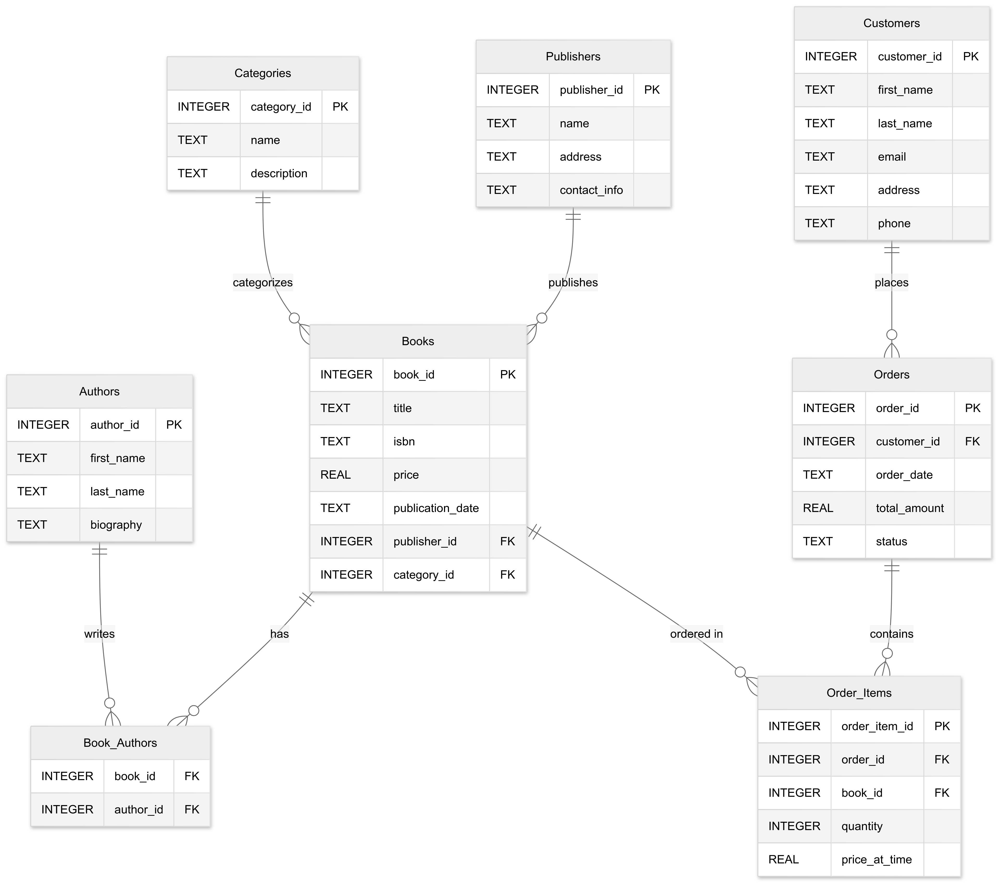

# ERD Diagrams

Entity-Relations Data model diagrams making and reading.

## Table of Contents

1. [Why do you need this knowledge?](#why-do-you-need-this-knowledge)
2. [What do you need to know?](#what-do-you-need-to-know)
   - [Data types](#data-types)
   - [Notations](#notations)
   - [Naming conventions](#naming-conventions)
3. [Example](#example)

## Why do you need this knowledge?

1. You can get an overview of accessible data just by looking at a diagram
2. You can understand the relationships between data entities just by looking at a diagram.
3. You can design and showcase the data structure for your team and/or project.

## What do you need to know?

You already know about primary and foreign keys [from the previous section](./intro-relational-data-model.md).

Now it's time you also discovered data types.

### Data types

Data types differ slightly, mostly in name, accross different [DBMS's](./intro-dbms.md).

Here we have listed data types for SQLite, which you are going to use in the class. **No need to remember all of these**. Keep in mind, you can alway refer back to this cheat-sheets or use [documentation](https://www.sqlite.org/datatype3.html) when in doubt!

| Data Type | Description       | Usage                           | Limitations                                               |
| --------- | ----------------- | ------------------------------- | --------------------------------------------------------- |
| INTEGER   | Whole numbers     | For IDs, counts, ages           | No decimal places                                         |
| REAL      | Decimal numbers   | For prices, measurements        | May have precision issues with very small/large numbers   |
| TEXT      | Text strings      | For names, descriptions, emails | No size limit but consider performance for very long text |
| BLOB      | Binary data       | For images, files               | Can store any data but may impact performance             |
| BOOLEAN   | True/False values | For flags, status indicators    | Stored as INTEGER (0 or 1) in SQLite                      |
| DATE      | Date values       | For dates                       | Stored as TEXT in SQLite                                  |
| TIME      | Time values       | For time                        | Stored as TEXT in SQLite                                  |
| DATETIME  | Date and time     | For timestamps                  | Stored as TEXT in SQLite                                  |

### Notations

An Entity-Relationship Diagram (ERD) notation is a standardized way to visually represent the structure of a database. It uses symbols and lines to show how different entities (tables) relate to each other. The most common notation is the Crow's Foot notation, which uses simple shapes and lines to represent relationships.

| Symbol      | Meaning        | Example                      |
| ----------- | -------------- | ---------------------------- |
| Rectangle   | Entity (Table) | Books, Authors               |
| Line        | Relationship   | Connection between tables    |
| Crow's Foot | "Many" side    | `>--` indicates many records |
| Single Line | "One" side     | `--` indicates one record    |

For example, in a bookstore database:

- `Books |--< Authors` shows that one book can have many authors
- `Publishers |--< Books` shows that one publisher can publish many books

Diagrams will have different notations depending on the creator choice (or team/project/school etc). There is no need to know the details of each or even differences. Just keep in mind, when you see something you never seen before, to keep an open mind and try to find similarities with what you already know!

### Naming conventions

Naming conventions in databases are similar to the ones used normally in software development.

It doesn't matter which convention you choose to use for your project. Just remember to **stay consistent**!!!

| Convention               | When Used                | Why Not Used                     |
| ------------------------ | ------------------------ | -------------------------------- |
| Singular (Book)          | Academic, legacy systems | Can be confusing for collections |
| Plural (Books)           | Modern web frameworks    | Can be unclear for single items  |
| PascalCase (BookTitle)   | Microsoft products       | Harder to read in SQL            |
| camelCase (bookTitle)    | JavaScript projects      | Not standard in SQL              |
| snake_case (book_title)  | Python, PostgreSQL       | Less common in some languages    |
| kebab-case (book-title)  | URLs, config files       | Not valid in SQL                 |
| Hungarian (strBookTitle) | Legacy Windows apps      | Verbose, outdated                |

## Example

Let's get back to the bookstore database from the previous session. Now we can go one by one and read each and every column of the diagram.

_created using [Mermaid](https://www.mermaidchart.com/play#pako:eNqtVMtOwzAQ_BUr9_xAbzwKQiCoUA8cIlnbZNusSOxgb4RK4d_Jq2nsuBUHeqnqGXtndnd6iFKdYbSI4jhOVKrVlnaLRAnBOZa4EAprNlAkqsPR3BLsDJQtQ4hrrd-tOPQ_2s_D83p5v3wVmwaQlInV4wlbL9_WgokL9M7IbtTp6HV59SQqQ6lPq-pNQSkwaSUzYJxX7Rg2R9OWvnucE5rbuNNmP8V_-q-rmnNtgmagg4J2tmQsSwWlL7aA8PmGdNO-Kt87xds-ygsKju0MeTqp8xytjt0IPun0auYroByyzKC13mmzMAwpS1Jb7VS*6VtNGKw-HcRfimdoU0NVO3u3Sm1Zl2cspgP4P5PDEqj4U0-qXCt0ZL6Y7IxG3SK-wJCBO99Af9MNQpcd1gyFhFLXir07loFrO5cmHxjLS_oa-JzI0UFoOS8t7kcNqvk72IeiL4ElU4mzlFjx_R3H-uBGZiGSKAebRG6Wz1E_TWNoZE9yMrnQM48pGcmTtZ6Rh6Wmrwl93M-BPWxC93YB6Yk5AFPaMJXu6TZmpEa20wqf3E0EM0GqpUc_vzO-wkA)*

### Books Table

| name             | purpose     | type    | description                                                                  |
| ---------------- | ----------- | ------- | ---------------------------------------------------------------------------- |
| book_id          | Primary Key | INTEGER | Unique identifier for each book, auto-incremented                            |
| title            | Value       | TEXT    | Book title, stored as text to handle any character                           |
| isbn             | Value       | TEXT    | International Standard Book Number, stored as text to preserve leading zeros |
| price            | Value       | REAL    | Book price, using REAL for decimal values                                    |
| publication_date | Value       | TEXT    | Date of publication, stored as TEXT in ISO format (YYYY-MM-DD)               |
| publisher_id     | Foreign Key | INTEGER | References publisher_id in Publishers table                                  |
| category_id      | Foreign Key | INTEGER | References category_id in Categories table                                   |

### Authors Table

| name       | purpose     | type    | description                                                    |
| ---------- | ----------- | ------- | -------------------------------------------------------------- |
| author_id  | Primary Key | INTEGER | Unique identifier for each author, auto-incremented            |
| first_name | Value       | TEXT    | Author's first name                                            |
| last_name  | Value       | TEXT    | Author's last name                                             |
| biography  | Value       | TEXT    | Author's biography, stored as text for variable length content |

### Book_Authors Table

| name      | purpose     | type    | description                           |
| --------- | ----------- | ------- | ------------------------------------- |
| book_id   | Foreign Key | INTEGER | References book_id in Books table     |
| author_id | Foreign Key | INTEGER | References author_id in Authors table |

### Publishers Table

| name         | purpose     | type    | description                                            |
| ------------ | ----------- | ------- | ------------------------------------------------------ |
| publisher_id | Primary Key | INTEGER | Unique identifier for each publisher, auto-incremented |
| name         | Value       | TEXT    | Publisher's name                                       |
| address      | Value       | TEXT    | Publisher's address                                    |
| contact_info | Value       | TEXT    | Publisher's contact information                        |

### Categories Table

| name        | purpose     | type    | description                                           |
| ----------- | ----------- | ------- | ----------------------------------------------------- |
| category_id | Primary Key | INTEGER | Unique identifier for each category, auto-incremented |
| name        | Value       | TEXT    | Category name                                         |
| description | Value       | TEXT    | Category description                                  |

### Customers Table

| name        | purpose     | type    | description                                                    |
| ----------- | ----------- | ------- | -------------------------------------------------------------- |
| customer_id | Primary Key | INTEGER | Unique identifier for each customer, auto-incremented          |
| first_name  | Value       | TEXT    | Customer's first name                                          |
| last_name   | Value       | TEXT    | Customer's last name                                           |
| email       | Value       | TEXT    | Customer's email address                                       |
| address     | Value       | TEXT    | Customer's address                                             |
| phone       | Value       | TEXT    | Customer's phone number, stored as text to preserve formatting |

### Orders Table

| name         | purpose     | type    | description                                              |
| ------------ | ----------- | ------- | -------------------------------------------------------- |
| order_id     | Primary Key | INTEGER | Unique identifier for each order, auto-incremented       |
| customer_id  | Foreign Key | INTEGER | References customer_id in Customers table                |
| order_date   | Value       | TEXT    | Date of order, stored as TEXT in ISO format (YYYY-MM-DD) |
| total_amount | Value       | REAL    | Total order amount, using REAL for decimal values        |
| status       | Value       | TEXT    | Order status (e.g., 'pending', 'completed', 'cancelled') |

### Order_Items Table

| name          | purpose     | type    | description                                                   |
| ------------- | ----------- | ------- | ------------------------------------------------------------- |
| order_item_id | Primary Key | INTEGER | Unique identifier for each order item, auto-incremented       |
| order_id      | Foreign Key | INTEGER | References order_id in Orders table                           |
| book_id       | Foreign Key | INTEGER | References book_id in Books table                             |
| quantity      | Value       | INTEGER | Number of books ordered                                       |
| price_at_time | Value       | REAL    | Price of book at time of order, using REAL for decimal values |
