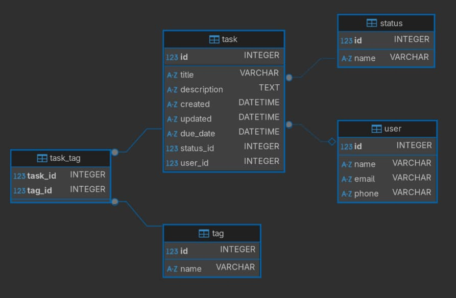

# Lesson plan

## TODO

> [!IMPORTANT]
> Review this lesson plan which is based on having a database setup with [lesson-data.sql](assets/lesson-data.sql), resulting in this database diagram:
> See <https://github.com/HackYourFuture-CPH/programme/pull/63/files#r2106791157>

Implement the following queries:

1. Select the names and phones of all users;
2. Select the name of the user with `id=10`;
3. Find how many users exist in the database;
4. Select the names of the first 5 users in the database;
5. Select the names of the last 3 users in the database;
6. Sum all the ids in the `user` table;
7. Select all users and order them alphabetically by name;
8. Find all tasks that include `SQL` either on the title or on the description;
9. Find the title of all tasks that the user `Maryrose` is responsible for;
10. Find how many tasks each user is responsible for;
11. Find how many tasks with a `status=Done` each user is responsible for;
