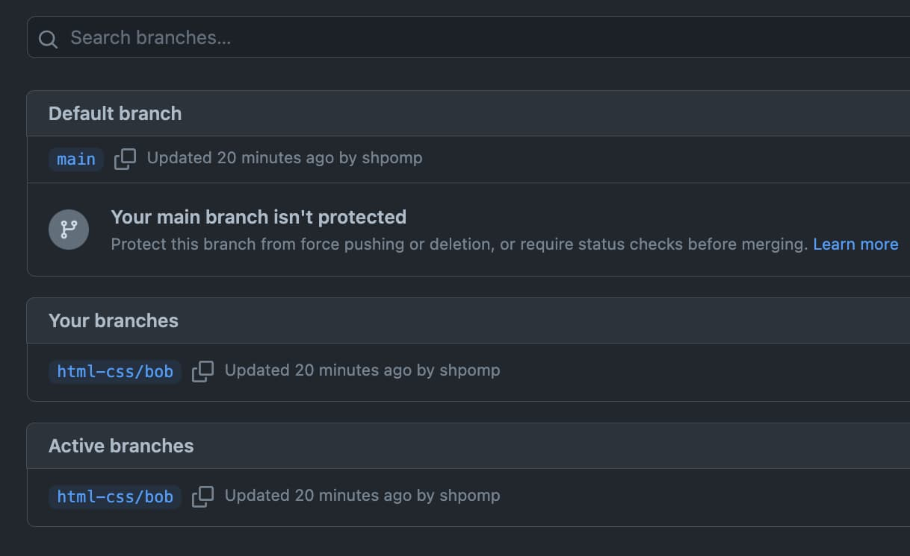
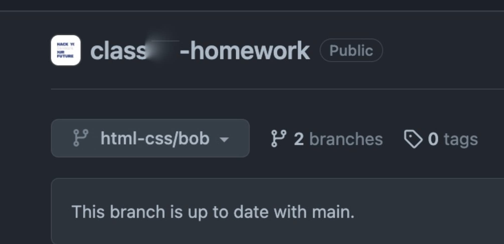

# How to submit the first assignment?

While you have not gone through [Git](../git/README.md) yet, you will submit your first assignment in a different way. This applies only to the first assignment. If you are confident with basic Git already, feel free to do the submission in a proper version-control way.

`1.` go to your assignment repository`*` on github and to the branches section:

`2.` find the "New branch" button and create a new branch, that follows the naming convention:

`html-css/your-name`

- ❌ html/css/maria
- ❌ hmtl-css/maria
- ❌ html-css-assignment
- ❌ html/maria
- ❌ htmlcss/maria
- ✅ html-css/maria

`3.` Go to the branch. It appears in the branch overview right after creation:

Or, if you are not there for some reason, go back to the repository overview and find your new branch in the drop-down:

To verify that you have switched to the branch, it should appear selected:

`4.` Go to the html-css folder and upload your assignment:

`5.` Write a commit message and press "Commit changes":

`6.` Go to "Pull requests" in the repository bar, and create a new pull request to the main branch <- from your branch:

`7.` Add title and description, then click "Create pull request"

`8.` That is it! You should see your pull request listed in the "Pull requests" tab.

`9.` Post a link to your assignment Pull Request in your team channel.

`*` It is either your own assignment repository in your own GitHub account or the central team assignment repository in the HackYourFuture-CPH GitHub account - depending on what approach is being followed for your team. Follow the information and instructions regarding this, and ask if you are still unsure.
