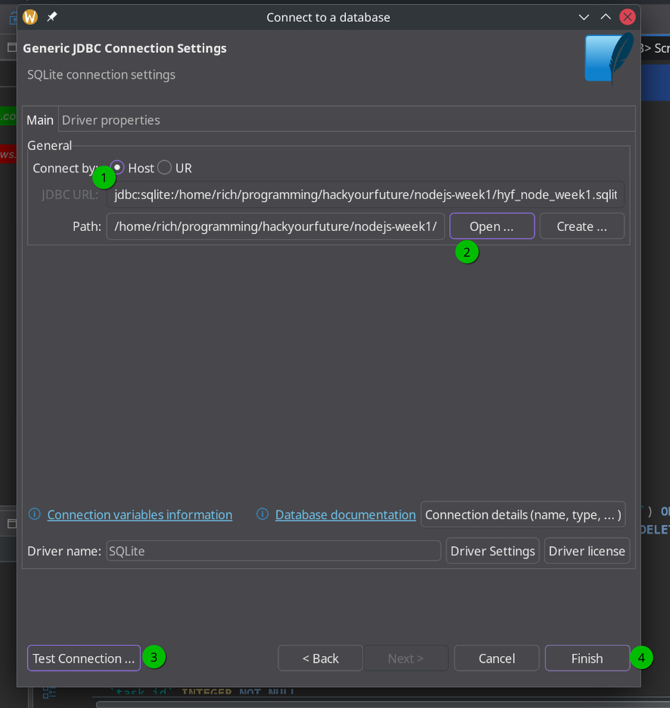

# User routes

## Note on server restarts

It is annoying to shutdown the server with Ctrl-C and start it again every time you make a change and want to test the change:

```shell
npm install --save-dev nodemon
```

Also, it is recommended to add a script to `package.json`, like so:

```json
"scripts": {
  "dev": "nodemon app.js"
}
```

There is a command to do that:

```shell
npm pkg set scripts.dev="nodemon app.js"
```

Now you can run

```shell
npm run dev
```

to start a server that automatically restarts when you make changes 🎉

## Database connection

To connect to the database, you can use DBeaver. After opening it:

- Create a new connection and choose an SQLite database
- For the connection settings, select your database, test the connection, and finish the setup.
- If prompted to install the SQLite driver, do so.



## Schema

Create a `users` table with the following fields:

- `id` (primary key)
- `created_at`
- `confirmed_at` (can be `NULL`)
- `first_name`
- `last_name`
- `email` (unique)

## Routes

- `/all-users` should respond with all users sorted by ID
- `/unconfirmed-users` should respond with unconfirmed users
- `/gmail-users` should respond with users with an @gmail.com email
- `/2022-users` should respond with users created in 2022

## More routes

- `/user-count` should respond with the number of users
- `/last-name-count` should respond with how many users there are with a given last name, sorted alphabetically
- `/first-user` should respond with the first user. If there are no users in the table, respond with a 404

## Frontend <-> Backend integration

Turn the `/` route into a HTML page that fetches the count value from `/user-count` and shows it. Feel free to style this in whatever way you see fit.

Optional: update the count every 2 seconds or something like that.
