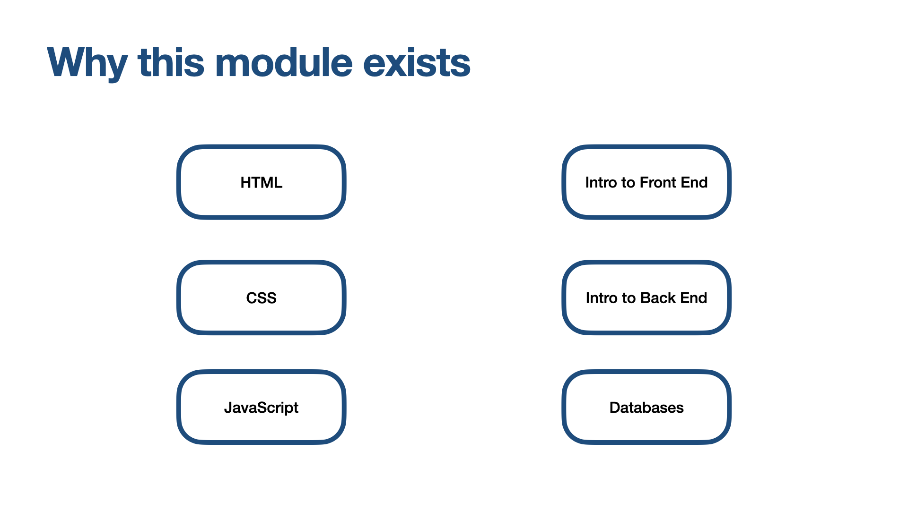
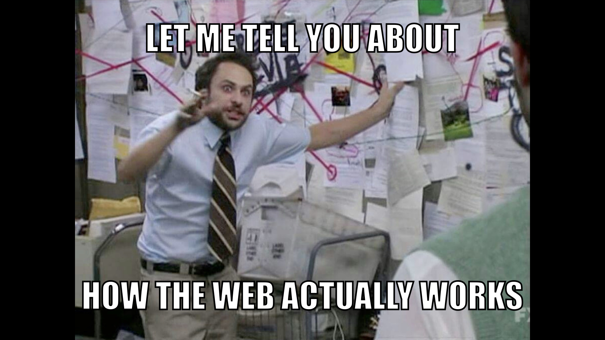

# Web Architecture 101: Introduction

<!--
  Key points:
  - this module is rather different from the other technical modules
  - you don't have to remember everything in this module
  - the purpose of this module is to give an understanding of how the remaining modules fit together
 -->

## Why this module exists

So far you've seen HTML, CSS, and some JavaScript.

Maybe you're looking ahead to the other modules and seeing things like "Node.js" and "Databases" and "Front End", and perhaps you're wondering what they mean, and how they fit into the picture.

That's where this module, Web Architecture 101, comes in. It's a bit different to the other technical modules: whereas with the other modules we look at lots of technical detail to _learn_ and _memorise_ and _explore_, this module is much more of an overview.

You're not expected to learn or remember every single detail of what's in this module. Rather, the important thing is to see how the various modules fit together, so that as you progress though the other modules, you have an understanding of where it sits in relation to the other modules.

Continue to [HTTP](../2-http/README.md)
