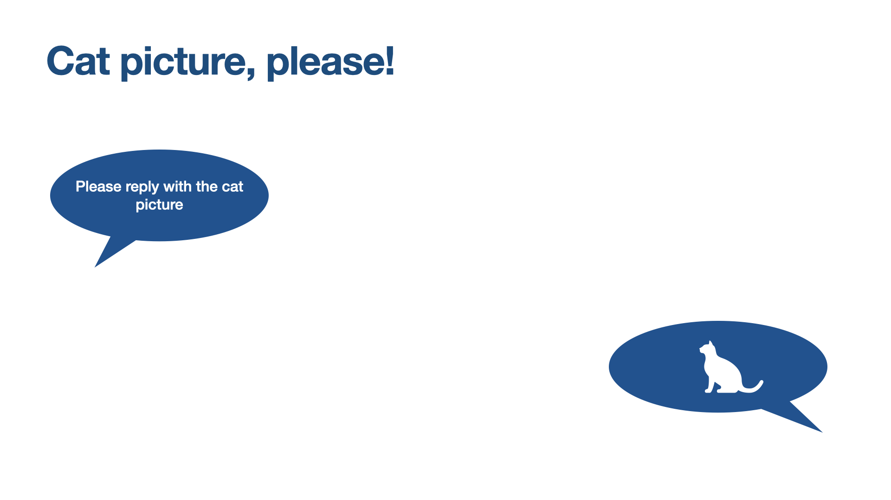
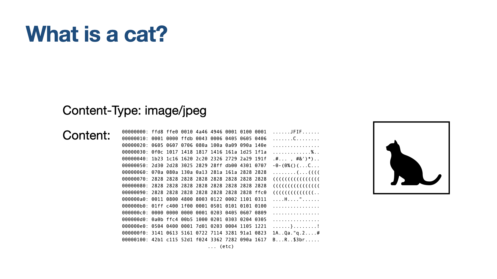
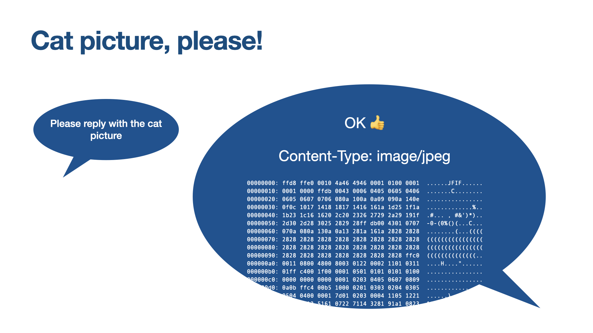
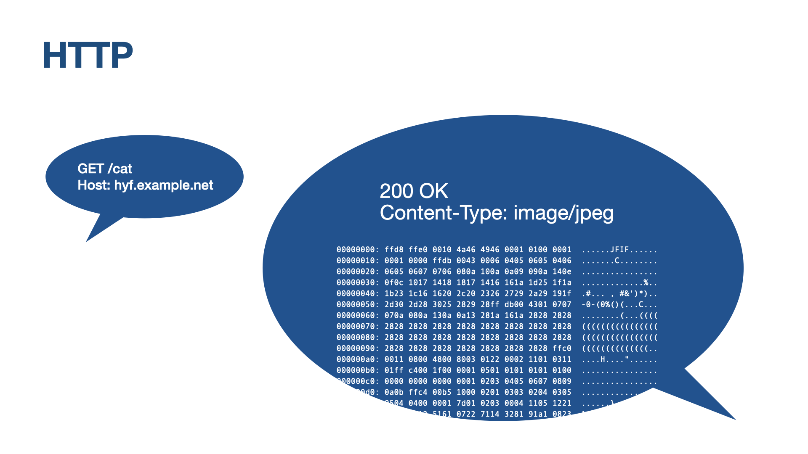
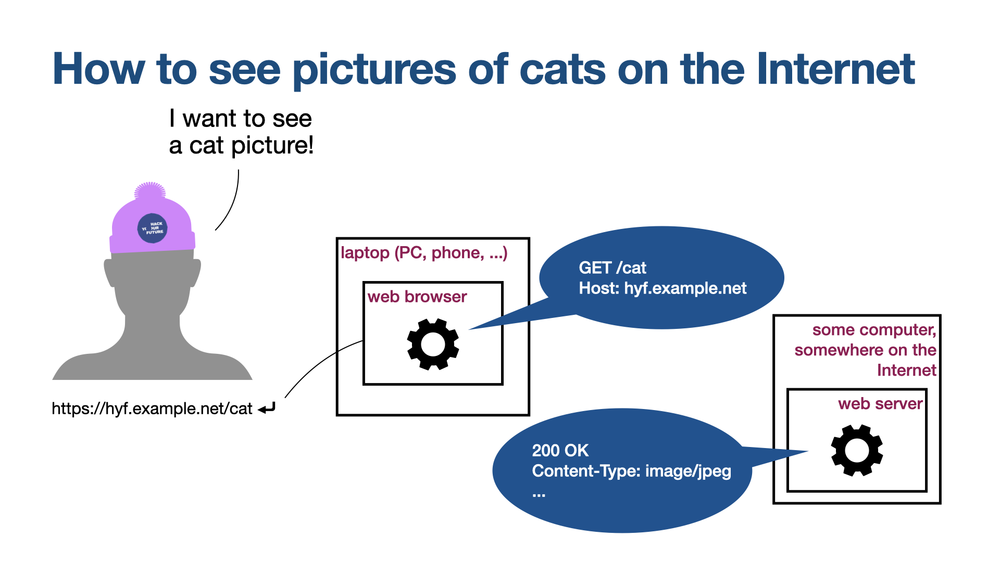

# HTTP

## HTTP and Content-Type

Once a connection has been established, the client and server can talk to each other. So what do they say?

Well, what is a cat (picture)?

On your computer, a photographic picture is often saved as a JPEG file — something dot J P G.
Inside that file, there's ... stuff. Data. Bytes.

On the Internet, filenames aren't so important. Instead, we talk about "content types". A content type answers the question, "How should I interpret all of these bytes?".

The content type for JPEG images is "image/jpeg".

So if you ask for a picture of a cat pic, then the answer looks like this. OK, content-type, data.

To turn that into the language that computers actually use to communicate:

"Please reply with the cat picture" becomes the pictured "GET" request. "/cat" is the path from the URL.
"OK here you go" becomes a "200 OK" response.

This is HTTP.

(HTTP is short for "Hypertext Transfer Protocol" — though if you say "Hypertext" these days, you'll probably get some pretty funny looks. It was a cool name in the early 1990s, honest!)

So finally, hurrah! You get a cat picture.

<!-- photo credit: Rachel Evans  -->

Continue to [Front End & Back End](../3-front-end-and-back-end/README.md)
