# What happens when you enter a URL into a web browser?

<!--
  Key points:
  - the structure of a URL (scheme, host, path)
  - finding a host with DNS
  - establishing a connection
  - Content-Type instead of file extension
  - an HTTP GET request/response, at the most simple level
 -->

What happens when you enter a URL into a web browser?

I have used this as an interview question before. There isn't a single definitive correct way to answer this question, because for each piece of the answer, you can either stop there, or dig deeper and uncover more pieces, and so on. How deep do you want to go?

Well, let's make a start.

## How to see pictures of cats

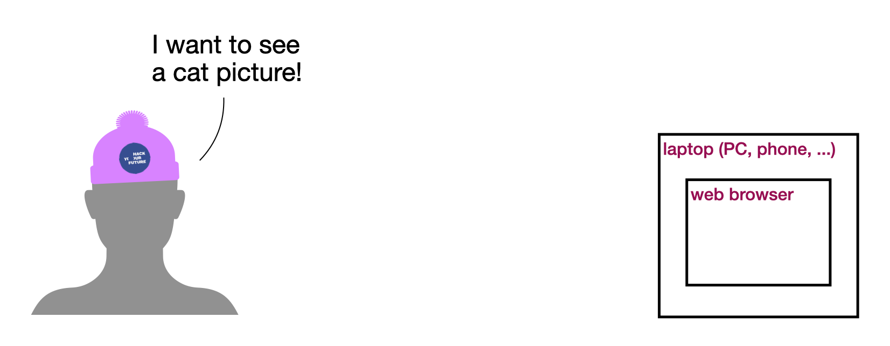

You have your computer (laptop, phone, whatever), with a working Internet connection, and you want to see a picture of a cat. You already know the exact URL. So you go to your web browser and type in the URL.

Your web browser is just software. So what does it do with what you typed in?

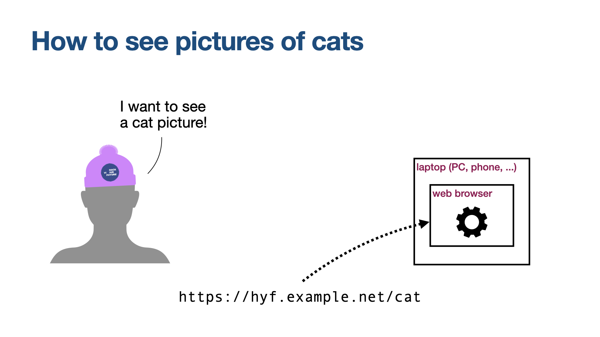

## Understanding URLs

Let's consider the URL `https://hyf.example.net/cat`

- The part up to the `:` is called the _scheme_: here, it's `https`. It tells the browser how to interpret the rest of the URL, and also how to actually go about fetching the resource at that URL.
- The part from `//` to the next `/` is the name of the _host_ (also known as the _server name_). Here, it's `hyf.example.net`.
- The part from that `/` onwards is called the _path_. Here, it's `/cat`.

## So many computers!

There are lots of computers on the Internet, and they all have addresses like "10.17.41.200" or "10.177.31.12". Which one should your web browser contact, to ask for the cat picture?

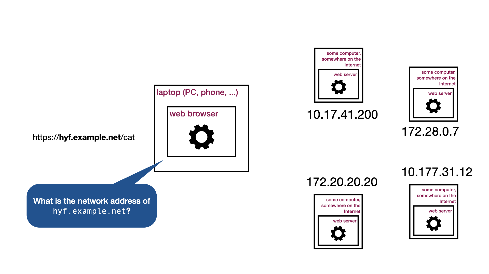

Something (typically, your Interner router) then replies with the answer:

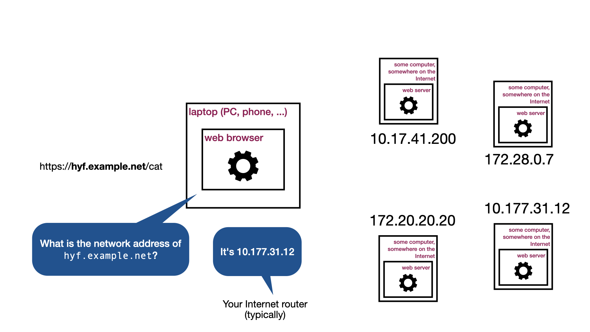

For example, it's 10.177.31.12.

The system that handles this is called DNS: the Domain Name System.

So, now your web browser knows which computer it needs to contact, and ask for the cat picture.

Next, it needs to _connect_ to that server.

## Connecting

Your computer (on behalf of your web browser, on behalf of you) asks to connect to the web server:

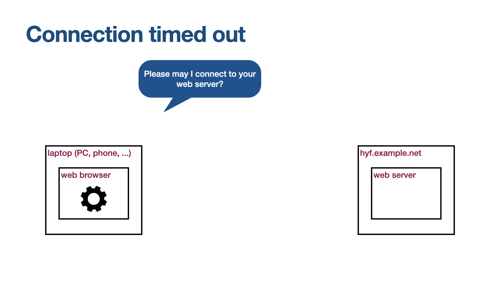

And ... well, maybe there's no reply.

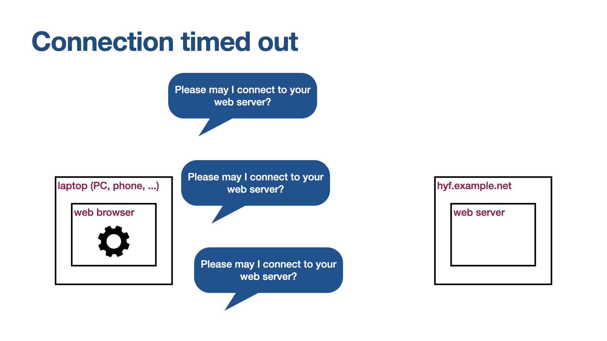

Nobody at home. Maybe the who server has crashed, or it's on fire, or been stolen. Maybe there isn't a server there any more. Maybe there never was.

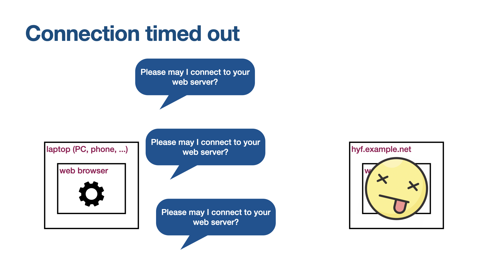

This is called a _connection timeout_.

### Connection, Denied!

Maybe there _is_ a server there... but it says "no".

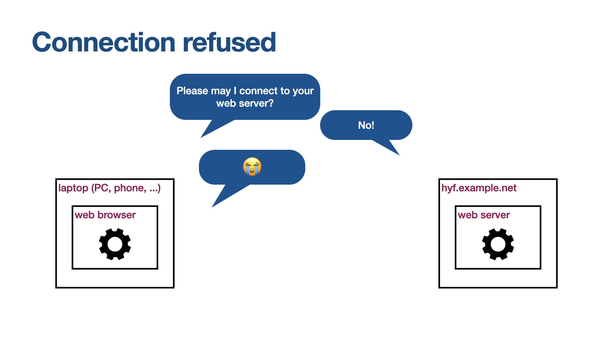

Maybe it's not a _web_ server at all.

Anyway: Sad times.

This is a "Connection refused" error.

### Contact!

Of course, mostly we're interested in the cases where the web server _is_ there:

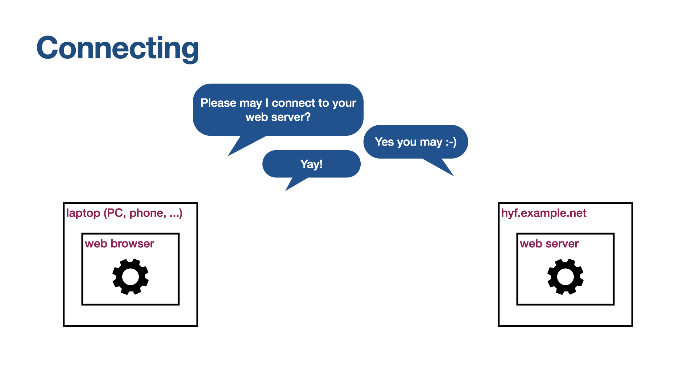

If this happens, then the two computers in question can now communicate over the connection:

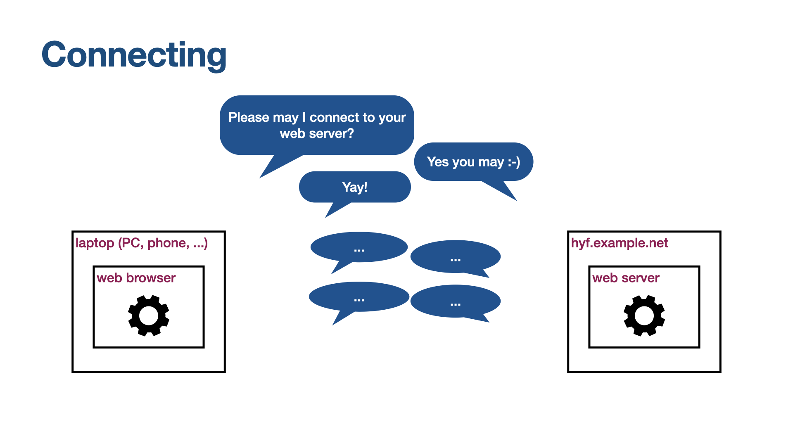

before finally disconnecting:

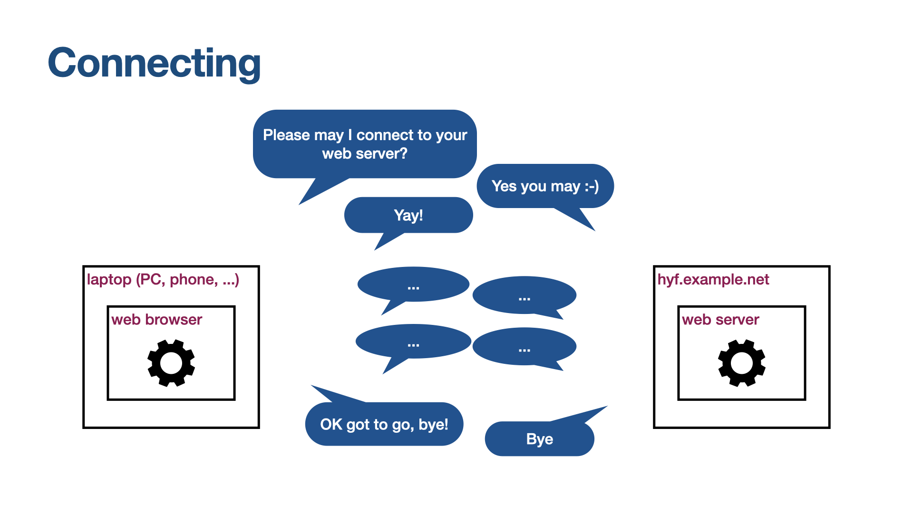

The connection is just a container for two streams of data, one in each direction. So what are they saying?

So... what's in that bit in the middle?

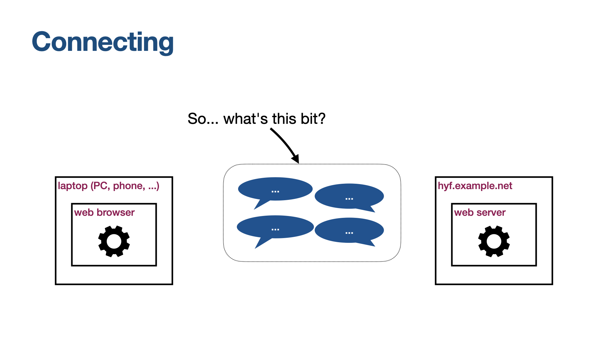

In the case of web servers: case: HTTP, that's what.

## HTTP and Content-Type

TODO

Hurrah! You get a cat picture.

<!-- photo credit: Rachel Evans  -->

Continue to [Front End & Back End](../3-front-end-and-back-end/README.md)
