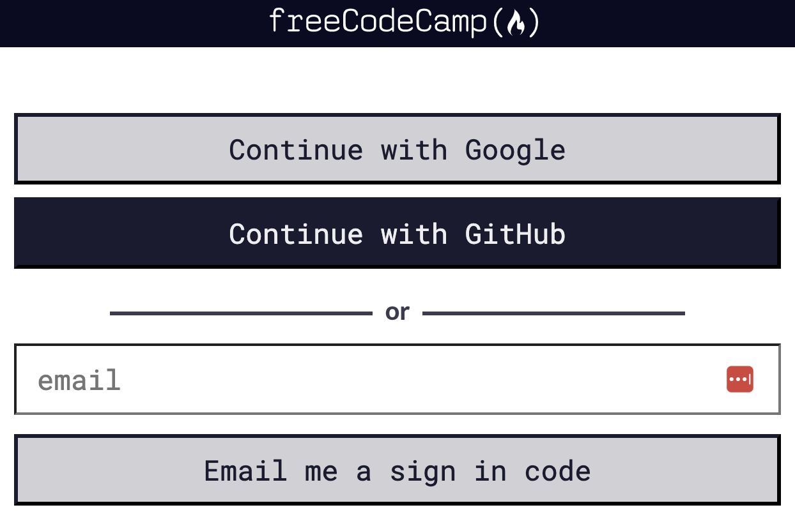

# 💻 FreeCodeCamp courses
This section describes what you need to do in the freeCodeCamp platform.

It is only a part of what you need to do, so make sure to keep a good pace!
You need to leave yourself time to make the [event-page-technical-task](event-page-technical-task/ "mention"), make a [project-overview-video.md](project-overview-video.md "mention"), and complete any additional parts before submission.

1. Create an account on GitHub (if you don't have one yet): [https://github.com/](https://github.com/)
2. Register on [https://www.freecodecamp.org](https://www.freecodecamp.org/) with your `Github profile`
   

3. Go into your [settings](https://www.freecodecamp.org/settings) on `freeCodeCamp` and make your timeline public:

Remember to save after changing the settings!

4. Complete all the steps in the first 2 courses in the [Responsive Web Design certification](https://www.freecodecamp.org/learn/2022/responsive-web-design/):

* 1\) Learn HTML by [Building a Cat Photo App](https://www.freecodecamp.org/learn/2022/responsive-web-design/learn-html-by-building-a-cat-photo-app/)
* 2\) Learn Basic CSS by [Building a Cafe Menu](https://www.freecodecamp.org/learn/2022/responsive-web-design/learn-basic-css-by-building-a-cafe-menu/)
   
   This is how the completed courses should look in your profile: 

   

Don't get frightened by the amount of steps in each course!

Most of the steps are very, very small - you are learning HTML and CSS through them very gradually. Each step might take you anywhere from 10 seconds to a couple of minutes, even for a complete web development newbie!

5. We recommend while going through the [Building a Cafe Menu](https://www.freecodecamp.org/learn/2022/responsive-web-design/learn-basic-css-by-building-a-cafe-menu/), following each step of the course you try to apply each step in the creation of your [event-page-technical-task](event-page-technical-task/ "mention"). This will allow you to progress in the most effective way and apply each topic you learn into the required task.

Of course this is just a recommendation on how you could approach this, so feel free to work and complete the task in whatever way you feel most appropriate.
